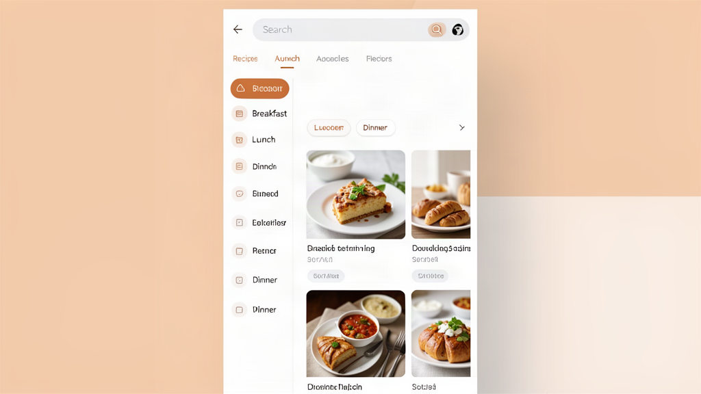
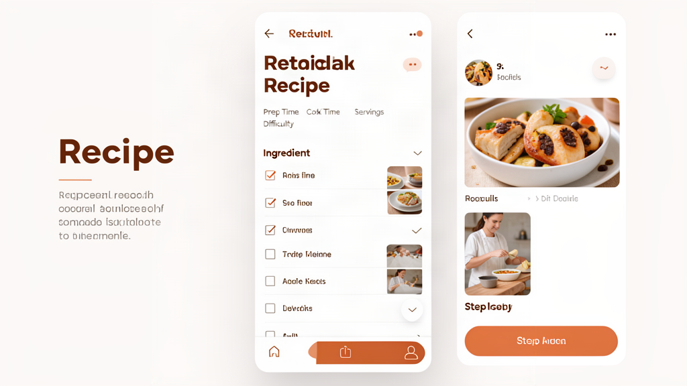
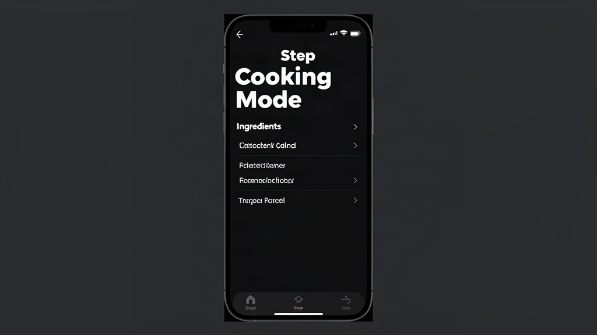
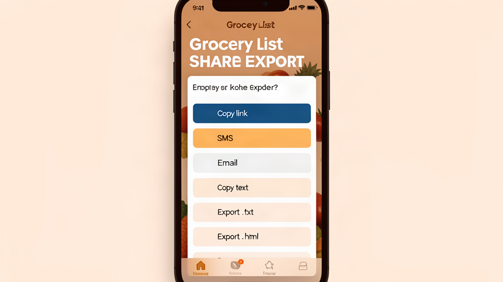

# WiskfFul

<div align="center">
  
</div>


[](LICENSE)

Self-hosted recipe/media app with:
- User auth (`admin` / `user` roles)
- Per-user profiles
- Admin approval flow for new accounts
- Media ingest from TikTok, YouTube, Facebook Reels
- File upload support
- Audio/subtitle extraction via `yt-dlp` + `ffmpeg`
- MySQL persistence
- Mobile-first web UI
- Docker Compose deployment
- Recipe photos, categories, favorites, print view, scaling
- Grocery list sharing via link, email, and text copy
- Hybrid category taxonomy: Breakfast/Lunch/Dinner + subcategories
- Per-step photos and ingredient checkoff
- Dark embedded cooking mode
- 5-star recipe ratings with average display
- 5 color themes (light, dark, dawn, cozy, high-contrast) with high contrast option
- Per-user profiles with avatar upload or 10 vegetable avatar selections
- Guest/demo account with read-only access (admin can enable/disable)
- Top navigation bar with compact icon buttons centered under the logo + 3-line hamburger dropdown menu
- Admin-only settings page for server config and user management (SMTP email configuration, guest login toggle, allowed hosts, database backup)
- Grocery list sharing via link, email, and text copy (SMS removed)
- Recipe multi-select export
- Recipe/meal plan deletion with cascade
- Compact header navigation with icon buttons + 3-line hamburger dropdown menu

## GUI examples

The app is mobile-first and uses warm minimalist styling. Key screens:

- **Home / recipe list** — hybrid category pills at top, searchable recipe cards
- **Recipe detail** — metadata, step photos, ingredient checkoff, share button, rating, edit/delete
- **Cooking mode** — dark kitchen-friendly UI with large step text
- **Grocery list** — full-page shareable list with copy/export actions
- **Create / edit** — form with category, subcategory, tags, servings, difficulty

*(Screenshots and further examples are available in the project wiki.)*






## Privacy

WiskfFul is a **self-hosted** application — all your data stays on your server.

- **No third-party analytics or tracking scripts** — the app collects nothing
- **GDPR compliance**: Export your data (`GET /auth/me/export`) or delete your account (`POST /auth/me/delete`) anytime
- **CCPA compliance**: No data is sold or shared; no opt-out required
- **Cookie policy**: JWT token stored in localStorage only (not a tracking cookie)
- **Full privacy policy**: See [PRIVACY.md](PRIVACY.md) or [privacy.wickedyoda.com](https://www.wickedyoda.com/privacy-policy-terms-of-use-disclaimer-and-limitation-of-liability/)
- **Account**: email, display name, hashed password (bcrypt)
- **Recipes**: titles, ingredients, instructions, categories, ratings
- **Media**: videos/audio/images downloaded from source URLs, thumbnails
- **Notes**: text notes attached to recipes
- **Grocery lists**: items, quantities, checked state
- **Meal plans**: planned recipes and dates
- **Settings**: your system configuration choices

### Data Rights (GDPR, CCPA)

**Your data, your control:**
- **Right to Access** — All your recipe data is accessible through the API and UI
- **Right to Data Portability** — Download all your data: `POST /auth/me/export`
- **Right to Erasure** — Delete your account and all associated data: `POST /auth/me/delete`
- **Right to Rectification** — Edit your recipes, notes, and profile at any time

### Third Parties
- **No analytics, tracking, or advertising**: The app does not use Google Analytics, Mixpanel, or any third-party tracking scripts
- **No data sharing**: Your data is never sent to external services
- **Media ingest**: Recipe videos are downloaded from their original source URLs (TikTok, YouTube, etc.) and stored locally — source URLs are stored to attribute the original creator

### Cookies
- The app uses a single **JWT access token** (stored in browser localStorage) for authentication
- No tracking cookies, no third-party cookies
- You may optionally enable a cookie consent banner in settings

### Hosted vs Self-Hosted
If you host WiskfFul yourself:
- Data is stored only on your server
- No data is transmitted to the WiskfFul developers or any third party

If you are using a hosted instance:
- Contact your instance administrator for the privacy policy
- Your data may be subject to the host's data practices

## Quick start

```bash
cp .env.example .env
# set MYSQL_ROOT_PASSWORD, MYSQL_PASSWORD, SECRET_KEY
# optionally set BACKEND_IMAGE/FRONTEND_IMAGE to GHCR tags
docker compose up -d
```

Open:
- Frontend: http://localhost:3000
- API: http://localhost:8000

## Env

- `DATABASE_URL` - default MySQL in compose
- `SECRET_KEY` - JWT secret
- `MEDIA_ROOT` - media storage path
- `PUBLIC_URL` - public base URL for shared links
- `ALLOWED_HOSTS` - comma-separated hostnames accepted by the API (add your deployment hostname)
- `ALLOWED_ORIGINS` - comma-separated CORS origins
- `GUEST_LOGIN_ENABLED` - enable/disable guest/demo login (default: `true`)
- `PUBLIC_URL` - public base URL for shared links (used in grocery share links)
- `BACKEND_IMAGE` / `FRONTEND_IMAGE` - GHCR image tags
- `BACKEND_PULL_POLICY` / `FRONTEND_PULL_POLICY` - image pull behavior, e.g. `always`
- `GHCR_TOKEN` - optional PAT with `read:packages` for private images

## CI / security

CI runs on pull requests via GitHub Actions:
- Python Lint
- Python Tests
- Python SAST & Dependencies
- Secrets & Container Scan
- YAML & Compose Validate
- Frontend Validate

## Wiki

See the project [Wiki](https://github.com/wickedyoda/recipe-app/wiki) for setup guides, API docs, and development notes.

## Changelog

See [CHANGELOG.md](CHANGELOG.md).

## License

This project is licensed under the **MIT License** with attribution requirement.

Original tooling and concepts are based on the excellent open-source video extraction ecosystem:
- [yt-dlp](https://github.com/yt-dlp/yt-dlp) (yt-dlp org contributors)
- [FFmpeg](https://ffmpeg.org/) (FFmpeg contributors)
- [OpenAI Whisper](https://github.com/openai/whisper) (OpenAI)

Original authors/owners retain copyright; this implementation adds app-specific integration, user auth, storage indexing, and packaging.
